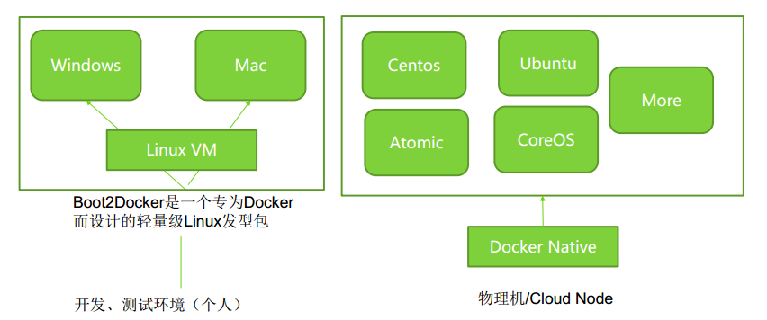

# Docker 安装与使用 #

## Docker 的部署安装 ##

Docker 采用Linux（内核）技术，所以只能运行在Linux上，官方说Linux kernel至少3.8以上

**安装：**以下仅针对**centos7**下的docker安装说明，其他操作系统请参考docker官网：docker.com

**下载并安装docker**

	curl -sSL https://get.daocloud.io/docker | sh

**设置docker镜像拉取加速器(国内用户)**

	curl -sSL https://get.daocloud.io/daotools/set_mirror.sh | sh -s http://00ff2cb2.m.daocloud.io
说明：00ff2cb2.m.daocloud.io 这个地址换成你再daocloud申请的

**启动docker服务，并设置开机启动**

	systemctl enable docker.service && service docker start
**注意**：防火墙

	systemctl disable firewalld

	换回默认的iptables服务：
	yum -y install iptables-services
	systemctl enable iptables
	systemctl start iptables

**docker版本查看：**
	
	docker version # 版本查看
	ip addr   # 网络查看

	
## Docker配置文件日志 ##

Docker配置文件： /etc/sysconfig/docker

**重要参数解释：**

	OPTIONS 用来控制Docker Daemon进程参数

	-H 表示Docker Daemon绑定的地址， -H=unix:///var/run/docker.sock -H=tcp://0.0.0.0:2375

	--registry-mirror表示Docker Registry的镜像地址--registry-mirror=http://4bc5abeb.m.daocloud.io

	--insecure-registry表示（本地）私有Docker Registry的地址， --insecure-registry ${pivateRegistyHost}:5000

	--selinux-enabled是否开启SELinux，默认开启 --selinux-enabled=true

	--bip 表示网桥docker0使用指定CIDR网络地址， --bip=172.17.42.1

	-b 表示采用已经创建好的网桥， -b=xxx

	重要参数解释：
	OPTIONS=-H=unix:///var/run/docker.sock -H=tcp://0.0.0.0:2375 --registrymirror=http://4bc5abeb.m.daocloud.io --selinux-enabled=true
	下面是代理的设置
	http_proxy=xxxxx:8080

	https_proxy=xxxxxx:8080
	
【Centos7】

	Docker 配置文件： /lib/systemd/system/docker.service

	ExecStart=/usr/bin/docker daemon -H fd:// -H=unix:///var/run/docker.sock -H=tcp://0.0.0.0:2375 --registrymirror=http://4bc5abeb.m.daocloud.io --selinux-enabled=true
	[Service]
	Environment="HTTP_PROXY=http://xxxxcom:8080"
	Environment="HTTPS_PROXY=http://xxxcom:8080"
	Type=notify
	ExecStart=/usr/bin/docker daemo

Docker 的日志文件写入到 /var/log/message 里

	tail -f /var/log/messages |grep docker

## Docker基础命令讲解 ##

	docker search # 搜索镜像

	docker pull   # 更新镜像

	docker images  #查看镜像

	docker run  # 运行镜像

	docker create/start/stop/pause/unpause # 容器生命周期相关指令

	docker ps a  # 查看容器列表

	docker -rm/irm

	docker attach
**docker run [OPTIONS] IMAGE[:TAG] [COMMAND] [ARG...]**

	决定容器的运行方式，前台执行还是后台执行

	docker run后面追加-d=true或者-d，那么容器将会运行在后台模式。

	docker exec来进入到到该容器中，或者attach重新连接容器的会话
	进行交互式操作（例如Shell脚本），那我们必须使用-i -t参数同容器进行数据交互

	docker run时没有指定--name，那么deamon会自动生成一个随机字符串UUID

	Docker时有自动化的需求，你可以将containerID输出到指定的文件中（PIDfile）： --cidfile=""

	Docker的容器是没有特权的，例如不能在容器中再启动一个容器。这是因为默认情况下容器是不能访问任何其它设

	备的。但是通过"privileged"，容器就拥有了访问任何其它设备的权限。

	例：
	docker run -it java java -version
	
	docker run -it java ps

	docker urn -it java uname 

	docker run java ip addr

	docker run java env

**docker create/start/stop/pause/unpause # 容器生命周期相关指令**

	案例：
	
	docker create -it --name myjava java java version
	
	docker create --name mysqlsrvl -e MYSQL_ROOT_PASSWORD=123456 -p 3306:3306 mysql