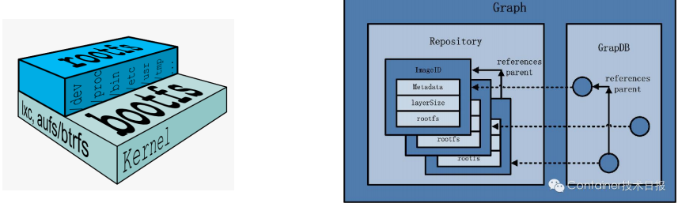
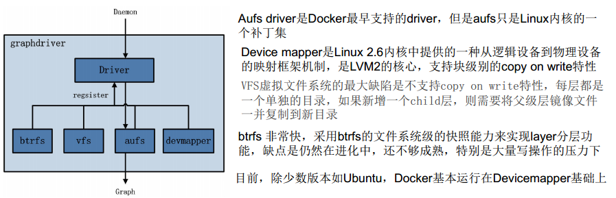
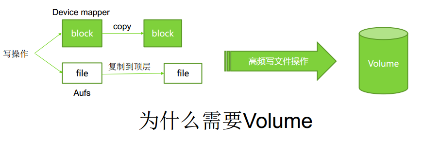
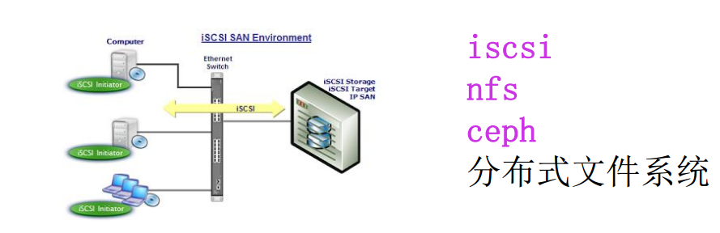
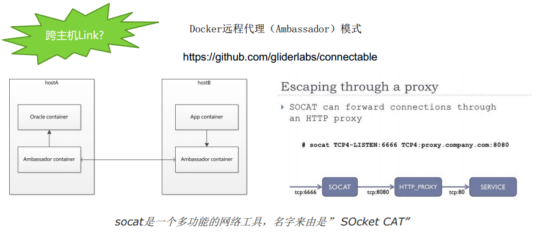
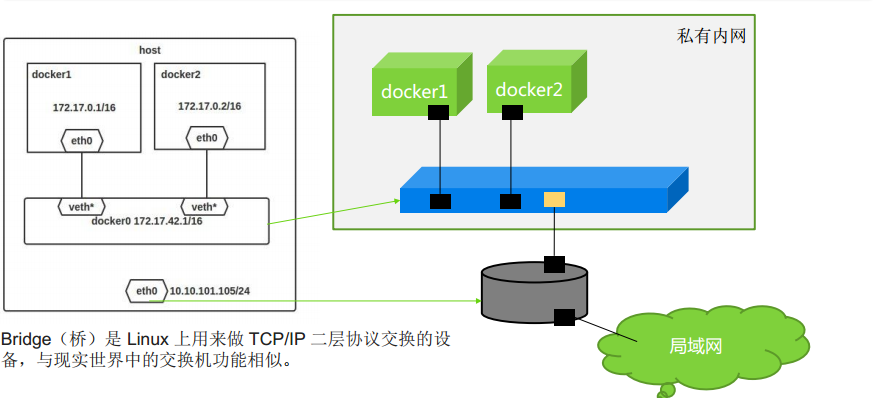
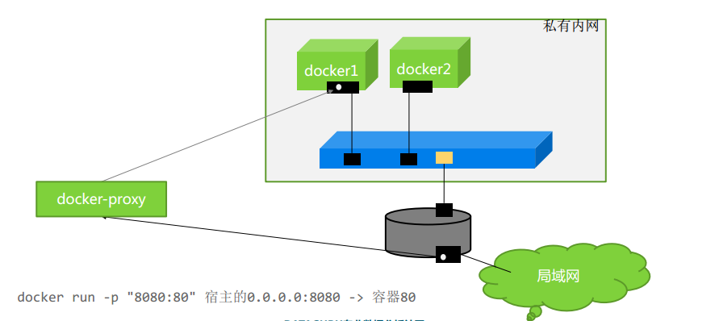

# Docker 实战之容器互联实战 #

## 基于Volume的互联 ##

**理解Docker Volume**

/var/lib/docker/graph 存放本地Image里的分层信息
/var/lib/docker/devicemapper/devicemapper/data 存储了Image与Container的二进制数据文件
/var/lib/docker/devicemapper/devicemapper/metadata 存储了相关元数据

	docker run -rm=true -it -v /leader java /bin/bash
	
	docker inspect ea667all631f

	docker run --rm=true -it -v /storage  /leader java /bin/bash

**可以多个容器中的Volume指向同一个本机目录，实现基于文件的共享访问**
	
	docker run --rm=true --privileged=true -it -v /storage:/leader java /bin/bash

**基于Volume的互联，也可以解决跨主机的共享问题**

**基于数据空气的单机互联**

	docker run -it -v /leader java /bin/bash

	docker run --rm=true --privileged=true --volumes-from=3kidi234251ksdi -it java /bin/bash

## 基于Link的互联 ##

	docker run --rm=true --name=mysqlserver -e MYSQL_ROOT_PASSWORD=123456 mysql
	
	默认情况下容器直接是互联的
	
	docker run --rm=true -it java curl 172.17.0.1:3306

**LINK 方式：**
docker 默认是允许container互通，通过-icc=false 关闭互通。一旦关闭了互通，只能通过-link name:alias 命令连接指定 -link name:alias 命令连接指定container.
-- link redis:db 的别名，会在/etc/hosts中生成对应的IP映射

--link=myjava:serverM1   # 给一个主机名（DNS名称） 用来替代IP进行访问目标容器(需要连接的容器)

## 基于网络的互联 ##

	docker run --rm=true --name=mysqlserver -p 8066:3306 -e MYSQL_ROOT_PASSWORD=123456 mysql

	docker-proxy -proto tcp -host-ip 0.0.0.0 --host-port 8006 -container-ip 172.17.0.5 --container-port 3306

有一些边缘情况没有更好的解决，本地主机路由Docker 实例通过其发布的端口调用；

	-A DOCKER ! -i docker0 -p tcp -m tcp --dport 8066 -j DNAT --to-destination 172.17.0.6:3306
	
	-A DOCKER -d 172.17.0.6/32 ! -i docker0 -o docker0 -p tcp --dport 3306 -j ACCEPT
	
	-A POSTROUTING -s 172.17.0.6/32 -d 172.17.0.6/32 -p tcp -m --dport 3306 -j MASQUERADE

**直接使用宿主机网络**

	docker run --rm=true --net=host --name=mysqlserver -e MYSQL_ROOT_PASSWORD=123456 mysql

**容器共用一个IP网络**

	docker run --rm=true --name=mysqlserver -e MYSQL_ROOT_PASSWORD=123456 mysql
	
	docker run --rm=true --net =container:mysqlserver java ip adder

	docker run --rm=true --net=container:mysqlserver java curl localhost:3306

备注：目前更为复杂的主流方向docker 容器的IP地址能够被另外主机所访问
