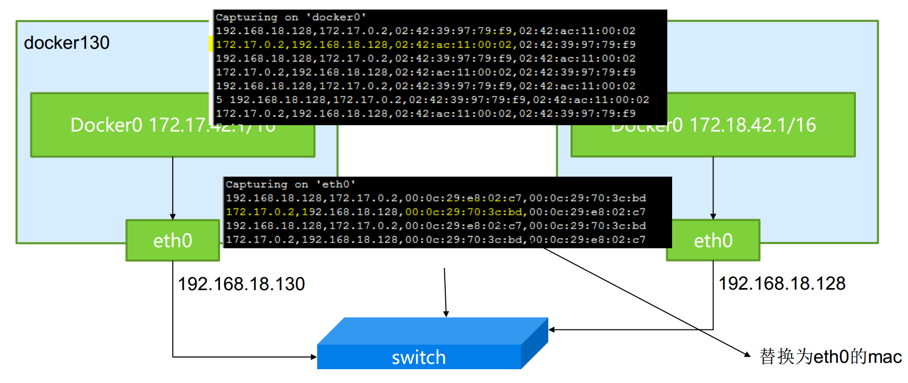
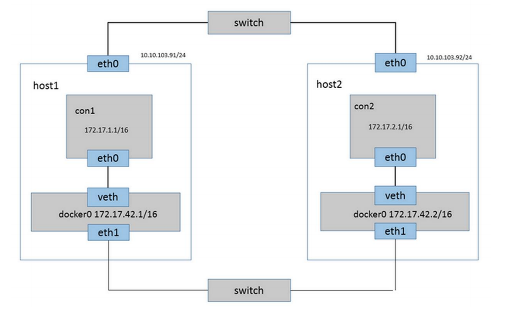

# Docker 实战之容器网络机制 #

## Linux路由机制定打通网络 ##

docker128 上修改Docker0的网络地址，与docker130不冲突

	vi  /usr/lib/systemd/system/docker.service
	
	ExecStart=/usr/bin/dockerd daemon --bip=172.18.42.1/16 -H fd:// -H=unix:///var/run/docker.sock
	
	systemctl daemon-reload
	systemctl restart docker.service

	docker130 上执行 route add -net 172.18.0.0/16 gw 192.168.18.128
	docker128 上执行 route add -net 172.17.0.0/16 gw        192.168.18.130

	docker130上启动一个容器，获取IP地址
		docker run --rm=true -it java /bin/bash
	docker128上 ping 172.17.0.1

	防火墙规则可能导致ping禁止  iptables -F ; iptables -t nat -F

	Docker130 上的一个容器ping 128上的一个容器
		Docker128 上抓包看结果：  tshark -f icmp
		tshark -i docker0 -f icmp	

Docker130 上的容器c1:172.17.0.1 ping docker128上的容器c2：172.18.0.1时，c1发现这个地址不是自己的子网，于是发给docker0网关；

经过路由计算，这个报文被发下一个跳的路由器端口：eth0,所以ttl减一

报文到达128主机的eth0网卡，经过路由计算，被发往下一跳的端口dock0:

注意到docker0上的ttl又减了一	

回来的时候，数据包流程:c2->128 docker0 ->128 eth0 ->130 eth0 ->130 docker0 ->c1

tshark -N m -e ip.src -e ip.dst -e eth.src -e eth.dst -Tfields -E separator=,-f"net 172.17.0.0/16"

## Docker网络方案一览 ##

**双网卡独立二层交换**(linux brige)

**Overlay 网络**

**基于ovs的Overlay网络**

**基于neutron的网络**

**官方的Libnetwork**

Socketplane 被docker公司收购，成为其官方网络的起源

开发者不想操作是否是VLANs,VXLANs,Tunnels 或者是TEPs，对于架构人们最关心的是性能和可靠性。而SocketPlane 在socket层面提供了一个网络的抽象层，通过可管理的方式去解决各种网络问题。

主要特性

- Open vSwitch集成
- 用于Docker的零配置多主机网络
- Docker/SocketPlay集群的优雅增长
- 主持多网络
- 分布式IP地址管理(IPAM)

- 1.将libnetwork集成到Docker Engine
- 2.在Docker CLI中使用新的network命令
- 3.撰写【-net】 参数的文档，以告知用户如何使用它来为容器指定网络
- 4.在network和endpoint中支持添加[label]
- 5.研发新的[bridge]插件，以替换Docker 目前的实现
- 5.研发[分布式bridge]插件，以支持跨容器网络

目前看到有一些计划是打算将OVS项目关联到Docker上来，从Linux Kernel 3.3开始， OVS项目就是内核的一部分。
当我听到这个的时候我觉得是不是脑袋让驴踢了。首先声明我并不是反对使用OVS，实际上，它是一个非常不错
的网络工具套件。它的设置比较复杂，对于新手来说有一个陡峭的学习曲线，但是一旦学会， OVS就可以帮你事
半功倍。关于这个话题我听到的一个讨论是：“如果OVS工作在Docker上，那么工作一切都变得很美好”。让我
告诉你，亲们：如果让我花费大量时间学习它，最后的结果只能是：“还好，可以用”。我并不想说的那么愤世
嫉俗，实际情况是在某些常用环境下OVS会崩溃。因此，使用OVS只是一种疯狂的想法罢了。