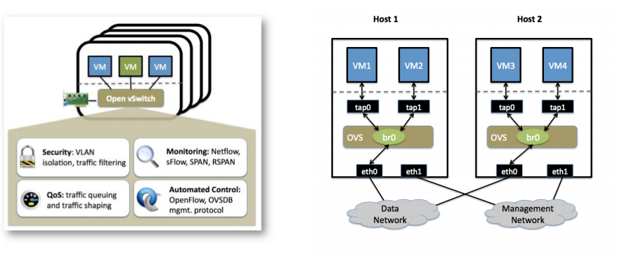

# Docker 实战容器网络机制下 #

## Linux namespace详解 ##

Linux Bridge 可以实现类似交换机的工作模式将多个不同Namespace上的网卡连通

## ovs+Docker实战 ##

	ovs-vsctl add-br br0
	ovs-vsctl add-port br0 gre1 -- set interface gre 1 type=gre
	option:remote_ip=192.168.18.128
	添加br0到本地docker0，使得容器流量通过OVS流向tunnel 
	brctl addif docker0 br0
	
	ip link set dev br0 up
	ip link set dev docker0 up
	
	iptables -t nat -F; iptables -F
	
	ip route add 172.17.0.0/16 dev docker0