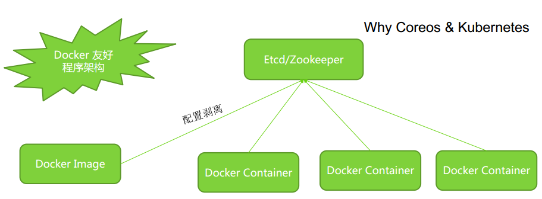

# Docker 实战之自定义镜像 #

## 将容器变成镜像 ##

docker commit <container> [repo:tag]

当我们在制作自己的镜像的时候，会在container中安装一些工具、修改配置，如果不做commit保存起来，那么container停止以后再启动，这些更改就消失了。
	
	例如：
	docker create --name myjava3 it java /bin/bash
	docker start myjava3
	docker ps
	docker exec -it d5c89f21f0d3 /bin/bash

	docker commit d5c89f21f0d3 myjava
	docker images
	docker run -it myjava ls
	
优点： 最方便，最快速，
缺点：不规范，无法自动化

## Buildfile 语法和案例 ##

一个Java 镜像的buildfile

	FROM nimmis/ubuntu:14.04
	MAINTAINER nimmis <kjell.havneskold@gmail.com>
	# disable interactive functions
	ENV DEBIAN_FRONTEND noninteractive
	# set default java environment variable
	ENV JAVA_HOME /usr/lib/jvm/java-8-openjdk-amd64
	RUN apt-get install -y software-properties-common && \
	add-apt-repository ppa:openjdk-r/ppa -y && \
	apt-get update && \
	apt-get install -y --no-install-recommends openjdk-8-jre && \
	rm -rf /var/lib/apt/lists/*

vi Dockerfile

	docker build -t leader/java .

**复杂案例实战：制作ubuntu+java+tomcat+ssh server镜像**

	FROM ubuntu
	MAINTAINER yongboy "@gmail.com"
	# 更新源，安装ssh server
	RUN echo "deb http://archive.ubuntu.com/ubuntu precise main universe"> /etc/apt/sources.list
	RUN apt-get update
	RUN apt-get install -y openssh-server
	RUN mkdir -p /var/run/sshd
	# 设置root ssh远程登录密码为123456
	RUN echo "root:123456" | chpasswd
	# 添加orache java7源，一次性安装vim， wget， curl， java7， tomcat7等必备软件
	RUN apt-get install python-software-properties
	RUN add-apt-repository ppa:webupd8team/java
	RUN apt-get update
	RUN apt-get install -y vim wget curl oracle-java7-installer tomcat7

	# 设置JAVA_HOME环境变量
	RUN update-alternatives --display java
	RUN echo "JAVA_HOME=/usr/lib/jvm/java-7-oracle">> /etc/environment
	RUN echo "JAVA_HOME=/usr/lib/jvm/java-7-oracle">> /etc/default/tomcat7
	# 容器需要开放SSH 22端口
	EXPOSE 22
	# 容器需要开放Tomcat 8080端口
	EXPOSE 8080
	# 设置Tomcat7初始化运行， SSH终端服务器作为后台运行
	ENTRYPOINT service tomcat7 start && /usr/sbin/sshd -D

使用Supervisor 管理Docker

	[supervisord]
	nodaemon=true

	[program:sshd]
	command=/usr/sbin/sshd -D

	[program:apache2]
	command=/bin/bash -c "source /etc/apache2/envvars && exec /usr/sbin/apache2 -DFOREGROUND"

## 镜像制作中的常见问题 ##

### ssh server是否应该包含到镜像里一个容器究竟运行几个程序？ ###
### 程序参数和配置文件的问题 ###
### 程序日志输出的问题 ###
