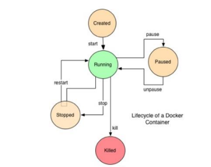
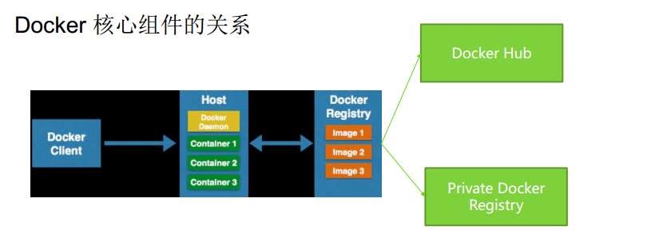

# 一、Docker 介绍 #

## 1、Docker 的历史与现状分析 ##

1. Docker的诞生和幕后的公司
2. 2010年，几个大胡子年轻人在旧金山成立了一家做 PaaS 平台的公司，
3. 起名为「 dotCloud」， dotCloud主要是基于PaaS平台为开发者
 或开发商提供技术服务。
4. Docker于2013.03.27 正式作为public项目发布
5. DotCloud公司2013年10月改名为Docker Inc，转型专注于Docker引擎和Docker生态系统。
6. 2014.1 被BLACK DUCK 评选为2013年10大开源新项目“ TOP 10 OPEN SOURCE ROOKIE OF THE YEAR”
7. 2014.9获取4000万美元融资，此时已经累计融资6600万美元
8. 2015.4月获取了9500万美元融资， 已经确立了在第三代PaaS市场的主导地位。
9. 2015.6月DockerCon 2015大会上， Linux 基金会与行业巨头联手打造开放容器技术项目Open Container Project
10. Docker已经收购了一系列创业公司，包括KiteMatic、 Koality和Socketplane。 完成新一轮投资后， Docker计划加快产品推进计划，在本季度推出Docker Hub企业版，并且在接下来几个月在存储、网络和安全三个产品方向发力。
11. 国内，不仅腾讯、阿里、百度、 Ucloud、青云等云计算服务提供商已经将Docker用到实践，还有数家Docker初创企业在获得了天使投资后正在辛勤的开发，准备将产品尽快发布到市场上。
12. 红帽在新的RHEL 7版本中增添了支持Docker的功能，IBM公开拥抱Docker和容器，亚马逊推出了EC2容器服务，就连公认的竞争对手VMware也宣布支持Docker。
13. 腾讯云计算公司对外宣布成为中国首家支持Docker Machine的云计算厂商，并将自身定位于Docker基础设施的服务商，迈出构建Docker“ 航运”基础设施的第一步。同时，在支持Docker Machine前提下，腾讯云也推出了常用
14. 系统的标准版Docker镜像，以方便用户能够一键便捷创建容器。

## 2、Docker的技术原理介绍 ##
- Docker就是虚拟化的一种轻量级替代技术。 Docker的容器技术不依赖任何语言、框架或系统，可以将App变成一种标准化的、可移植的、自管理的组件，并脱离服务器硬件在任何主流系统中开发、调试和运行
 
- 简单的说就是，在 Linux 系统上迅速创建一个容器（类似虚拟机）并在容器上部署和运行应用程序，并通过配置文件可以轻松实现应用程序的自动化安装、部署和升级，非常方便。因为使用了容器，所以可以很方便的把生产环境和开发环境分开，互不影响，这是 docker 最普遍的一个玩法。
### 2.2、Docker相关的核心技术 ###

### 2.3、Docker相关的核心技术之cgroups ###

- Linux 系统中经常有一个需求就是希望能限制某个或者某些进程的分配资源，于是就出现了cgroups的概念，cgroup就是contrller group,在这个group中，有分配好的特定比例的cpu时间，IO时间，可用内存大小等。cgroups是将任意进程分组化管理的linux内核功能，最初由google的工程师提出，后来被整合进linux内核中。
- cgroups中的重要概念是“子系统”，也就是资源控制器，每种子系统就是一个资源的分配器，比如cpu子系统是控制cpu时间分配的，首先挂载子系统，然后才有control group ，比如先挂载memory子系统，然后在memory子系统中创建一个cgroup节点，在这个节点中，将需要控制的进程id写入，并且将控制的属性写入，这就完成了内存的资源限制。
- cgroups被Linux内核支持，有得天独厚的性能优势，发展势头迅猛。在很多领域可以取代虚拟化技术分割资源。cgroup默认有诸多资源组，可以限制几乎所有服务器的资源：cpu mem iops,iobandwide,net,device acess等

### 2.4、Docker 相关的核心技术之LXC ###
- Lxc是Linux containers的简称，是一种基于容器的操作系统层级的虚拟化技术。借助于namespace的隔离机制和cgroup限额功能，Lxc提供了一套统一的API和工具来奖励和管理container。Lxc跟其他操作系统层次的虚拟化技术相比，最大的优势在于lxc被整合进内核，不用单独为内核打补丁。

- Lxc旨在提供一个共享kernel的OS级虚拟化方法，在执行时不重复加载kernel，且container的kernel与host共享，因此可以大大加快container的启动过程，并显著减少内存消耗，容器在提供隔离的同事，还通过共享这些资源节省开销，这意味着容器笔真正的虚拟化的开销要小得多。在实际测试中，基于lxc的虚拟化方法的IO和CPU性能几乎接近barmetal的性能

- 虽然容器所使用的这类型的隔离总的来说非常强大，然而是不是像运行hypervisor上的虚拟机那么强壮具有争议性。如果内核停止，那么所有的容器 就会停止运行。

- 性能方面：LXC>>KVM>>XEN

- 内存利用率：LXC>>KVM>>XEN

- 隔离程度：  XEN>>KVM>>LXC

### 2.5、Docker 相关的核心技术之AUFS ###
- 什么是AUFS？ AUFS是一个能透明覆盖一或多个现有文件系统的层状文件系统。支持将不同目录挂载到同一个虚拟文件系统下，可以把不同的目录联合一起，组成一个单一的目录，这是一个虚拟文件系统，文件系统不用格式化，直接挂载即可

- Docker一直用AUFS作为容器的文件系统，当一个进程需要修改一个文件时，AUFS创建该文件的一个副本。AUFS可以把多层合并成文件系统的单层表示。这个过程称为写入复制（copy on write）。

- AUFS允许Docker把某些镜像作为容器的基础。例如，你可能有一个可以作为很多不同容器的基础CentOS系统镜像，多亏AUFS，只要一个CentOs镜像的副本就够了，这样既节省了存储和内存，也保证更快速的容器部署

- 使用AUFS另一个好处是Docker的版本容器镜像能力，每个新版本都是一个与之前版本的简单差异改动，有效地保持镜像文件最小化，但，这也意味你总是要有一个记录该容器从一个版本到另一个版本改动的审计跟踪。
### 2.6、Docker原理之App打包 ###
- Lxc的基础上，Docker额外提供的Feature包括：标准统一打包部署运行方案

- 为了最大化重用Image，加快运行速度，减少内存和磁盘footprint，Docker container运行时所构造的运行环境，实际上是由具有依赖关系的多个Layer组成的，例如一个apache的运行环境可能是在基础的rootfs images的基础上，叠加了包含例如Emacs等各种工具的image，在叠加包含apache及其相关依赖library的image，这这image由AUFS文件系统加载合并到统一路径中，以只读的方式存在，最后在叠加加载一层可写的空白的Laye用作记录对当前运行环境所作的修改。

- 有了层级化的imags做基础，理想中，不同的APP就可以既可能的共用底层文件系统，相关依赖工具等，同一个app的不同实例也是可以实现共用绝大多数数据，进而以copy on wirite的形式维护自己的那一份修改过的数据等；

### 2.7、Docker全生命周期开发模式 ###
Source->Dev->QA->CI/CS 
Build ->  Ship -> Run -> Build

## 3、Docker的基本概念 ##
**Docker Image**

- **Docker Image**是一个极度精简版的Linux程序运行环境，比如vi这种基本的工具没有，官网的JAVA镜像包括的东西更少，除非是镜像叠加方式的，如Centos Image 是需要
- 定制化Build的一个“安装包”，包括基础镜像应用的二进制部署包

- **Docker Image** 内部建议有运行期需要修改的配置文件

- **Dockerfile** 用来创建一个自定义的Image，包含了用户指定的软件依赖等。当前目录下包含Dockerfile，使用命令Build来创建新的image

- **Docker Image**的最佳实践之一是尽量重用和使用网上公开的基础镜像

**Docker Container**

- **Docker Container** 是Image的实例，共享内核

- **Docker Container** 里可以运行不同OS的Image，比如Ubuntu的或者Centos

- **Docker Container** 不建议内部开启一个SSHD服务，1.3版本后新增了docker exec 命令进入容器排除问题

- **Docker Container** 没有IP地址，通常不会有服务端口暴露，是一个封闭的“盒子/沙箱”

**Docker Container的生命周期**

**Docker Daemon**

- Docker Daemon 是创建和运行Container的Linux守护进程，也是Docker最主要的核心组件

- Docker Daemon可以理解为Docker Container 的Container

- Docker Daemon 可以绑定本地端口并提供Rest API服务，用来远程访问和控制

**Docker Registry/Hub**

Docker 的官方Registry（Docker Hub）的生态圈也是相当吸引人眼球的地方。在Docker Hub上可以下载，拉取即可；
问题点：
Docker Hub 是dotCloud 公司私有的国内目前只有DaoCloud提供代理缓存服务；

Docker 核心组件关系

## 4、Docker学习必备基础技能 ##
- Linux基础操作和基本知识：磁盘，文件，日志，用户，权限，安全，网络，系统
- 虚机相关技能：vmware workstation/virtbos 熟练使用，虚机clone，组网，host-only网络，net网络等熟练操作